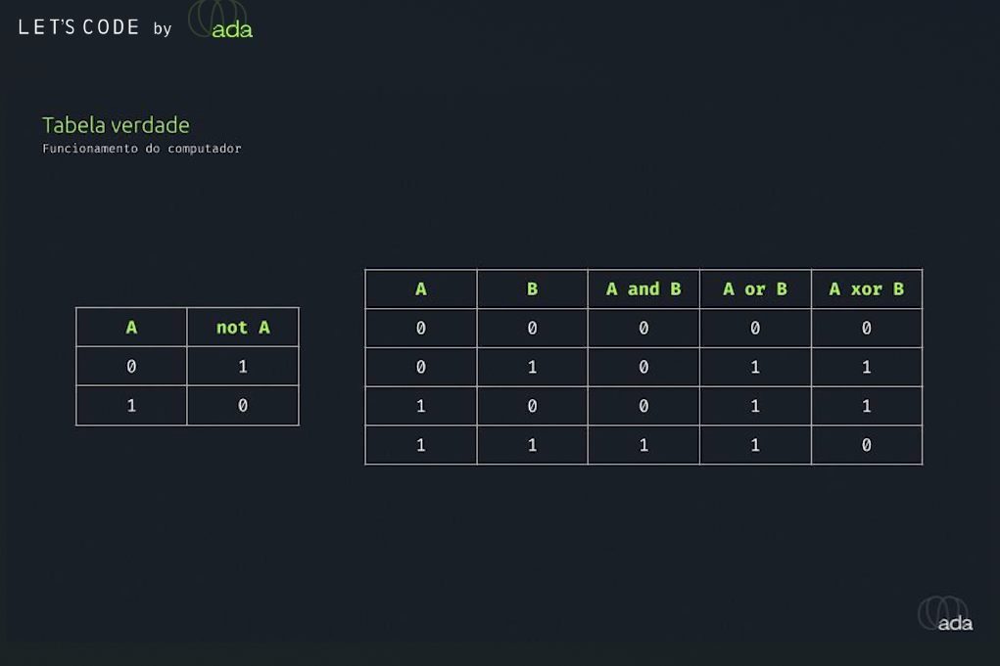

## Um mergulho no mundo da lógica computacional

### O que é lógica?
Lógica é a ciência do raciocínio correto. Ela estuda as formas de pensar, as relações entre proposições e as regras de inferência. Na computação, a lógica é a base para a construção de algoritmos e a tomada de decisões. 

### Que tipo de lógica o computador consegue trabalhar?
Computadores trabalham com **lógica booleana**, desenvolvida por George Boole. Essa lógica se baseia em dois valores: **verdadeiro** (1) e **falso** (0). Todas as operações e cálculos dentro de um computador são reduzidos a combinações desses dois valores.

### Quem foi George Boole?
George Boole foi um matemático e lógico inglês do século XIX. Ele é conhecido por ter desenvolvido a álgebra booleana, que é a base da lógica digital utilizada em todos os computadores modernos.

### Tabela verdade
Uma tabela verdade é uma tabela que mostra todos os possíveis valores de entrada para uma operação lógica e o resultado correspondente. Ela é usada para visualizar e analisar como as operações lógicas funcionam.

### Símbolos das portas lógicas
As portas lógicas são os blocos básicos de construção dos circuitos digitais. Elas realizam operações lógicas simples, como AND, OR, NOT, NAND, NOR e XOR. 

* **AND (E):** Só retorna 1 (verdadeiro) se todas as entradas forem 1. Símbolo: ∧
* **NAND (NÃO E):** É o inverso do AND. Retorna 0 (falso) se todas as entradas forem 1. Símbolo: NAND ou ¬(A ∧ B)
* **OR (OU):** Retorna 1 se pelo menos uma das entradas for 1. Símbolo: ∨
* **NOR (NÃO OU):** É o inverso do OR. Retorna 0 se pelo menos uma das entradas for 1. Símbolo: NOR ou ¬(A ∨ B)
* **XOR (OU EXCLUSIVO):** Retorna 1 se as entradas forem diferentes. Símbolo: ⊕

### Circuito integrado
Um circuito integrado (chip) é um componente eletrônico que contém milhares ou milhões de transistores interconectados para realizar funções específicas. Os circuitos integrados são a base de todos os dispositivos eletrônicos modernos, incluindo computadores, smartphones e tablets.

### Tunelamento quântico e computação quântica
* **Tunelamento quântico:** É um fenômeno da mecânica quântica onde uma partícula pode atravessar uma barreira, mesmo que não tenha energia suficiente para isso, de acordo com as leis da física clássica.
* **Computação quântica:** É um campo da computação que explora os princípios da mecânica quântica para realizar cálculos. Ao invés de bits (0 ou 1), a computação quântica utiliza qubits, que podem representar 0, 1 ou ambos simultaneamente. Isso permite que os computadores quânticos resolvam certos tipos de problemas muito mais rapidamente do que os computadores clássicos.

**A computação quântica tem o potencial de revolucionar diversos campos, como:**

* **Desenvolvimento de novos materiais:** Simulando as propriedades de materiais em nível atômico para criar materiais com características específicas.
* **Criptografia:** Quebrando códigos criptográficos atuais e desenvolvendo novos algoritmos de criptografia mais seguros.
* **Inteligência artificial:** Criando algoritmos de aprendizado de máquina mais poderosos e eficientes.
* **Simulação de sistemas complexos:** Simulando sistemas complexos, como moléculas e o universo, para obter uma melhor compreensão de como eles funcionam.

