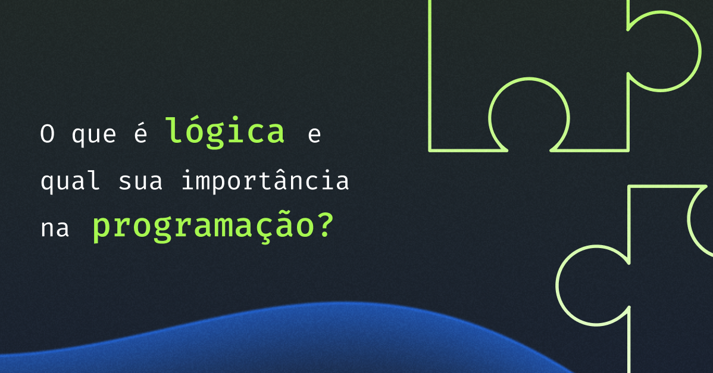

## O que é lógica e porque ela é importante na programação?

O que é lógica?
Lógica é uma maneira específica de raciocinar. O termo foi originado na Grécia, aproximadamente V a.C, e pode ser interpretado como a ciência do raciocínio. 

Originalmente aplicada à linguagem verbal, a lógica define estruturas e regras. Uma afirmação é considerada uma proposição, e um conjunto de regras podem ser aplicadas a uma série de proposições que testam sua validez. 

Existem diversos tipos de lógica — como a predicativa e a proposicional. Cada uma possui características e regras próprias. Na programação, normalmente, é usada a lógica formal, que aborda alguns conceitos da computação — e, para você saber mais, vamos te contar sobre a importância de saber lógica para aprender a programar. 


Por que estudar lógica para aprender a programar?
Para criarmos algoritmos, é essencial saber especificar passos sequenciais e lógicos, e como eles se comportam em conjunto.

A lógica nos permite especificar esses passos e sequências, que nos levam a obter o resultado desejado — assim como uma receita culinária, com ingredientes e passos a serem seguidos.

Desenvolver esse tipo de raciocínio nos permite pensar de maneira mais estruturada, similar a de como um computador atua — e, para quem quer aprender a programar, o raciocínio lógico torna a prática mais fluida e natural.


Importância da lógica na programação
Assim como na vida real, organizamos uma sequência de passos lógicos para realizar tarefas diárias. Um exemplo, é quando vamos trocar uma lâmpada: o passo a passo que seguimos é, basicamente: 

- 1 - Desligar a lâmpada
- 2 - Pegar a lâmpada nova
- 3 - Pegar a escada
- 4 - Subir na escada
- 5 - Remover a lâmpada antiga
- 6 - Colocar a lâmpada nova
- 7 - Testar se deu certo

O mesmo tipo de raciocínio sequencial pode ser aplicado para situações na computação, como por exemplo, quando fazemos uma transferência entre contas, ou uma compra em um e-commerce. Os passos são diferentes, mas o raciocínio é o mesmo.

Vamos fazer outro exemplo, dessa vez, mais próximo ao pensamento de um computador. Para isso, vamos usar um pseudocódigo, que nada mais é do que especificar um algoritmo, mas sem os detalhes de uma linguagem de programação.

Imagine uma calculadora que faça uma divisão:

```
ALGORITMO

 LEIA DIVIDENDO

 LEIA DIVISOR

 RESULTADO <- DIVIDENDO/DIVISOR

 IMPRIMA RESULTADO

FIM
``` 

Com os passos lógicos especificados como pseudocódigo, chegamos muito próximos da implementação em uma linguagem de programação.


Como aplicar lógica no dia a dia? 
Além dessas práticas cotidianas que citamos acima, existem outras maneiras de desenvolver o raciocínio lógico. 

No dia a dia, para executar uma tarefa específica — como limpar a casa e arrumar o armário —, podemos simplificá-las com um passo a passo, com o objetivo de facilitar o procedimento.

Uma forma de desenvolver o raciocínio lógico de maneira divertida e, consequentemente facilitar o aprendizado e a prática de programação, é por meio dos jogos — como Sudoku, jogo da memória, quebra-cabeça, xadrez, etc.

Conclusão
A lógica simplifica o processo de aprendizado de programação.

Com uma boa base, é possível compreender com solidez diversos conceitos fundamentais, que serão adquiridos futuramente na jornada de se tornar um bom desenvolvedor — como dominar uma linguagem de programação, aprender paradigmas como programação orientada a objetos. 